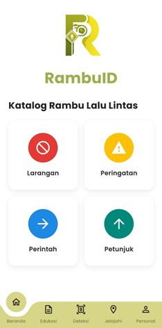
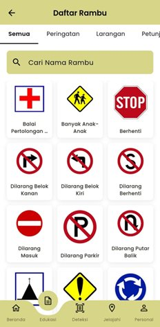
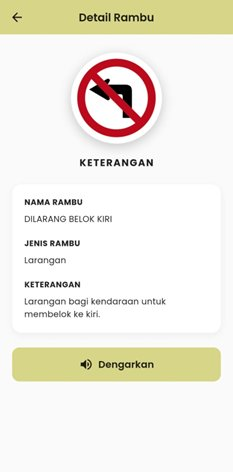
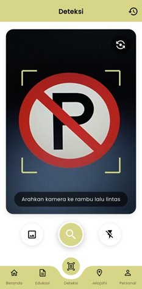
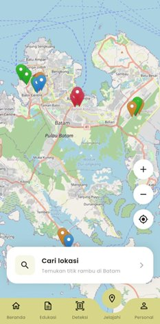
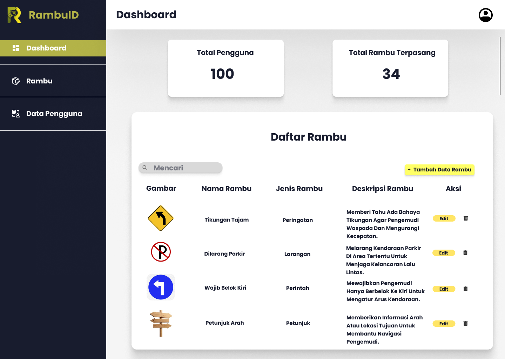

<p align="center">
  
</p>

<h1 align="center">RambuID</h1>

<p align="center">
  Aplikasi mobile pengenalan rambu lalu lintas Indonesia berbasis kecerdasan buatan (AI).<br/>
  RambuID dirancang untuk membantu pengguna dalam mengenali, memahami, dan mempelajari<br/>
  berbagai jenis rambu lalu lintas secara digital dan interaktif.<br/><br/>
  Dilengkapi fitur deteksi rambu real-time menggunakan model <strong>YOLOv5</strong>,<br/>
  katalog rambu lengkap dengan informasi detail dan audio,<br/>
  serta peta sebaran lokasi rambu lalu lintas di wilayah <strong>Batam</strong>.
</p>

---

## 📸 Preview

<p align="center">
  
  
  
  
  
</p>
<p align="center">
  
</p>

---

## ✨ Fitur

- **Deteksi Rambu** — Scan rambu lalu lintas lewat kamera atau galeri menggunakan model YOLOv5
- **Katalog & Edukasi** — Daftar lengkap rambu beserta deskripsi dan audio
- **Detail Rambu** — Informasi nama, jenis, keterangan, dan fitur dengarkan (TTS)
- **Jelajahi Peta** — Lokasi rambu di wilayah Batam dengan marker interaktif
- **Riwayat** — Simpan riwayat rambu yang pernah dipindai
- **Multi-bahasa** — Mendukung Bahasa Indonesia dan Bahasa Inggris
- **Admin Dashboard** — Manajemen data rambu dan pengguna

---

## 🛠️ Tech Stack

| Layer | Teknologi |
|---|---|
| Mobile Frontend | Flutter (Dart) |
| Backend API | FastAPI (Python) |
| AI / Detection | YOLOv5 (PyTorch) |
| Database | SQLite (SQLAlchemy ORM) |
| Peta | Flutter Map + OpenStreetMap |
| Auth | JWT + Bcrypt |

---

## 📁 Struktur Project

```
rambuid/
├── backend/
│   ├── app.py              # FastAPI - main server
│   ├── best.pt             # Model YOLOv5 terlatih
│   ├── rambuid.db          # Database SQLite
│   ├── requirements.txt    # Python dependencies
│   ├── start_server.bat    # Jalankan server (Windows CMD)
│   ├── start_server.ps1    # Jalankan server (PowerShell)
│   └── static/
│       └── images/rambu/   # Aset gambar rambu
└── frontend/
    ├── lib/
    │   ├── main.dart
    │   ├── auth/           # Login & Register
    │   ├── features/       # Beranda, Deteksi, Edukasi, Peta
    │   ├── profile/        # Profil, Riwayat, Pengaturan
    │   ├── admin/          # Dashboard admin
    │   └── services/       # API & DB service
    └── pubspec.yaml        # Flutter dependencies
```

---

## 🚀 Cara Menjalankan

### Prasyarat
- Python 3.10+
- Flutter SDK 3.9+
- Android Studio / VS Code

### 1. Clone Repository
```bash
git clone https://github.com/elsaveroo/rambuid.git
cd rambuid
```

### 2. Jalankan Backend
```bash
cd backend

# Buat virtual environment
python -m venv venv
venv\Scripts\activate        # Windows
# source venv/bin/activate   # Linux/Mac

# Install dependencies
pip install -r requirements.txt

# Jalankan server
python app.py
# atau klik dua kali start_server.bat (Windows)
```
Server berjalan di `http://localhost:8000`

### 3. Jalankan Frontend
```bash
cd frontend

# Install Flutter packages
flutter pub get

# Jalankan di emulator / device
flutter run
```

> **Catatan:** Pastikan backend sudah berjalan sebelum menjalankan frontend. Sesuaikan base URL API di `lib/services/api_service.dart` dengan IP backend kamu.

---

## 📦 Dependencies Utama

**Backend**
- `fastapi` — Web framework
- `ultralytics` — YOLOv5 inference
- `sqlalchemy` — ORM database
- `torch` — Deep learning (PyTorch)

**Frontend**
- `camera` — Akses kamera untuk deteksi
- `flutter_map` — Peta interaktif
- `flutter_tts` — Text-to-speech audio rambu
- `http` — Komunikasi dengan API